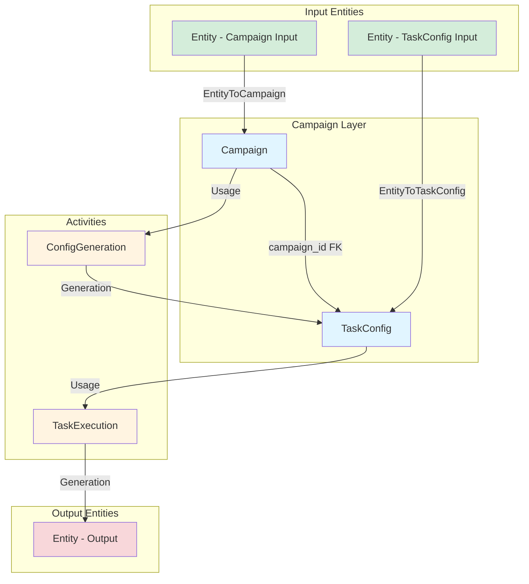
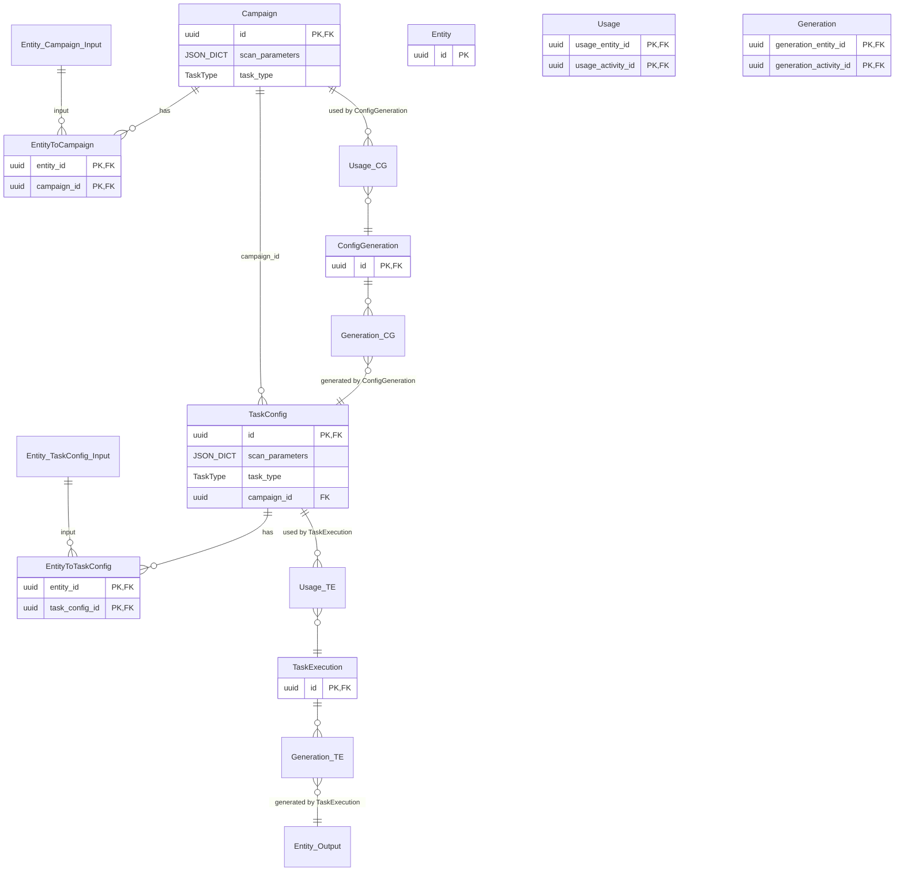

# Campaign Models Relationship Diagram

## ER Diagram

## Relationships Explained

### Flowchart (Primary)
Shows the workflow clearly:
- **Green boxes**: Input entities
  - Campaign inputs (linked via EntityToCampaign)
  - TaskConfig inputs (linked via EntityToTaskConfig)
- **Blue boxes**: Campaign entities (Campaign and TaskConfig)
- **Yellow boxes**: Activities (processes)
- **Red box**: Output entities (generated by TaskExecution)
- Input and output entities are different instances, though all are Entity type

### ER Diagram (Detailed)
Shows the same relationships with Usage and Generation tables split by activity:
- **EntityToCampaign**: Junction table linking input entities to Campaign
- **EntityToTaskConfig**: Junction table linking input entities to TaskConfig
- **Usage_CG**: Usage records for ConfigGeneration activity
- **Generation_CG**: Generation records for ConfigGeneration activity
- **Usage_TE**: Usage records for TaskExecution activity
- **Generation_TE**: Generation records for TaskExecution activity

Notes:
- Campaign has many input entities (via EntityToCampaign)
- TaskConfig has many input entities (via EntityToTaskConfig)
- One Campaign is used by ConfigGeneration to generate many TaskConfig
- One TaskConfig can be used by many TaskExecution, each generating many Entity
- Activities (ConfigGeneration, TaskExecution) do not have task_type field
