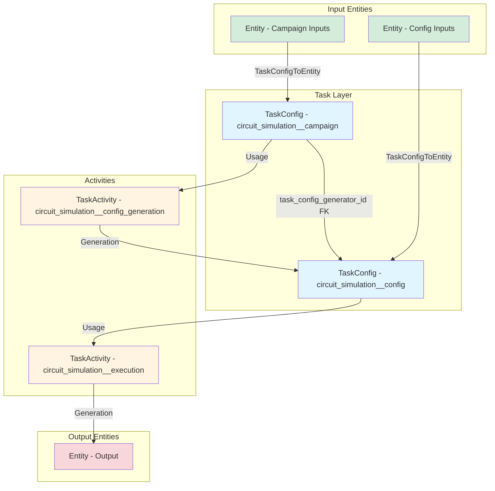
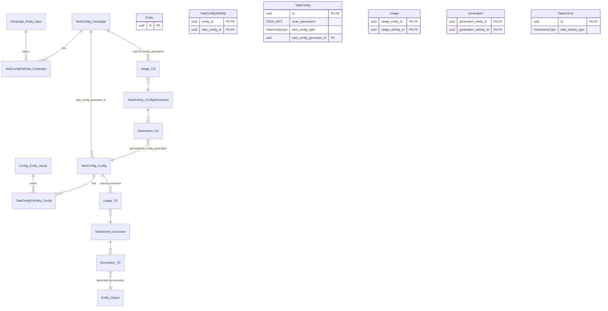

# Task Models Relationship Diagram

## ER Diagram

## Relationships Explained

### Flowchart (Primary)
Shows the workflow clearly:
- **Green boxes**: Input entities
  - Campaign inputs (linked via TaskConfigToEntity)
  - Config inputs (linked via TaskConfigToEntity)
- **Blue boxes**: TaskConfig with different types
  - circuit_simulation__campaign
  - circuit_simulation__config
- **Yellow boxes**: TaskActivity (processes)
  - circuit_simulation__config_generation
  - circuit_simulation__execution
- **Red box**: Output entities (generated by execution)
- Input and output entities are different instances, though all are Entity type

### ER Diagram (Detailed)
Shows the same relationships with Usage and Generation tables split by activity:
- **TaskConfigToEntity**: Junction table linking input entities to TaskConfig (both campaign and config types)
- **Usage_CG**: Usage records for config_generation activity
- **Generation_CG**: Generation records for config_generation activity
- **Usage_TE**: Usage records for execution activity
- **Generation_TE**: Generation records for execution activity

Notes:
- TaskConfig[circuit_simulation__campaign] has many input entities (via TaskConfigToEntity)
- TaskConfig[circuit_simulation__config] has many input entities (via TaskConfigToEntity)
- One TaskConfig[campaign] is used by TaskActivity[config_generation] to generate many TaskConfig[config]
- One TaskConfig[config] can be used by many TaskActivity[execution], each generating many Entity
- TaskActivity has task_activity_type field (enum: circuit_simulation__config_generation, circuit_simulation__execution, etc.)
- TaskConfig has task_config_type field (enum: circuit_simulation__campaign, circuit_simulation__config, etc.)
